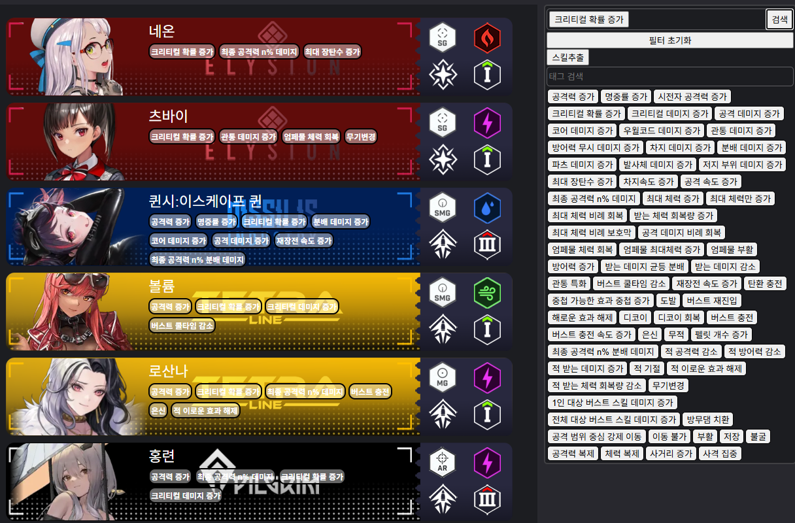

# NIKKE_wiki

게임 '승리의 여신 : 니케' 의 정보를 모아둔 사이트 제작을 위한 리포지토리

## **왜 만드나요?**

**승리의 여신 : 니케(GODDESS OF VICTORY：NIKKE)** 는 여러 종류의 고유한 **'니케'** 라는 캐릭터들을 최대 5명까지 골라 하나의 스쿼드로 편성하여 적(랩쳐)을 섬멸하거나 승리 조건을 달성하는 게임입니다.

이때, 각 니케는 고유한 스킬효과,공격속성(이하 '우월코드'),무기,소속기업 등 다양한 요소가 각각 다르게 조합되어 있어, 스쿼드를 편성할 때 서로에게 알맞은 효과나 서로의 스킬을 강화할 수 있는 조합으로 편성해야 합니다. 

우월코드이나 무기, 소속기업과 같은 속성에 대한 니케 필터링 검색은 인게임 내에서 지원을 하고 있지만, 스킬효과에 대한 필터링 검색은 아직까진(25/07/01) 전무한 것으로 판단했습니다.

저는 이 게임을 플레이하면서 '이 니케는 차지 속도 증가 버프를 가진 니케와 조합하는게 좋을거 같은데 이런 효과를 가진 니케가 뭐가 있지?' 라고 생각하면서 찾아볼 때 마다 하나하나씩 스킬들을 보면서 찾았습니다. 이럴때 마다 큰 불편함을 느껴 **스킬의 대표적인 효과를 태그로 만들어 검색이 가능한 위키** 의 필요성을 느껴 제작하게 되었습니다.

## **주요 기능은 뭔가요?**

주요 기능은 **니케가 가진 스킬의 대표적인 효과를 태그화 하여 검색하는 기능** 입니다.

### ▲ 필터링 되기 전

### ▲ 필터링 된 후

또한, 원하는 니케의 프로필 카드를 클릭하면 세부 정보창으로 이동됩니다.

### ▲ 니케의 세부 정보

## **최종 목표는 뭔가요?**

도메인을 할당받아 실제로 운영까지 하는걸 목표로 합니다.
**해당 웹사이트는 상업의 목적이 아니며 수익을 창출하지 않습니다.**